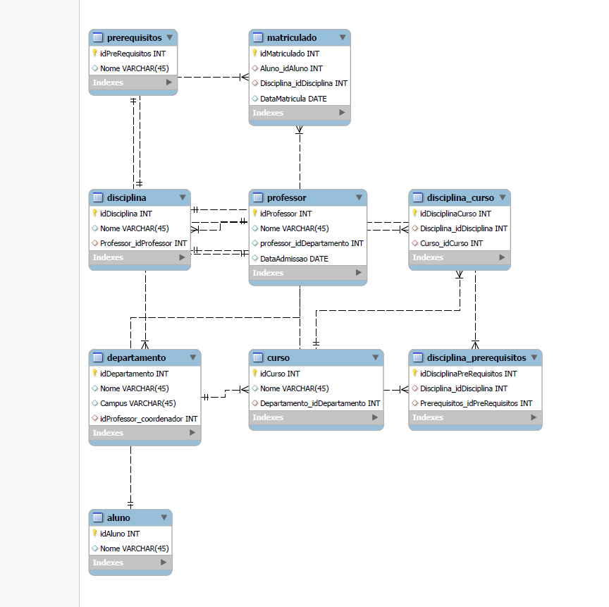
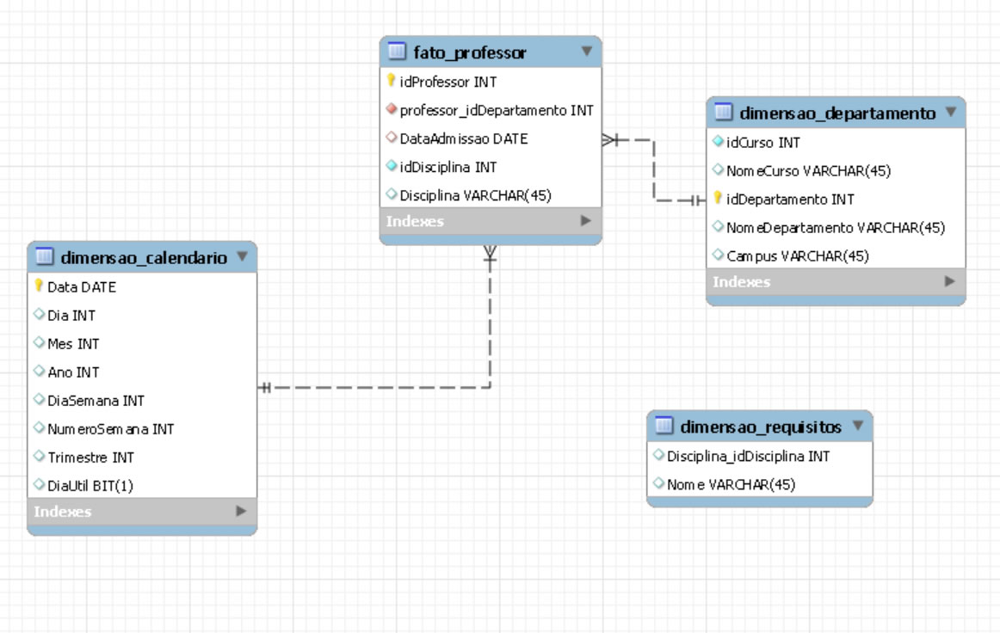

# Desafio Power BI - Módulo 5 DIO - Star Schema

No desafio "Dashboard de Vendas com Power BI utilizando Star Schema" do módulo "Modelagem de Dados com Power BI" do Bootcamp "Data Analytics com Power BI" foi feita uma modelagem em SQL de forma relacional e a conversão dele para um modelo em formato de star schema.

Modelo Relacional

Star Schema

Neste repositório se encontram os scripts SQL usados durante o desafio.
